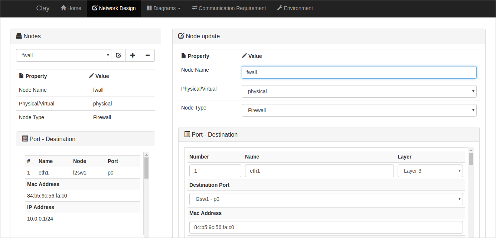
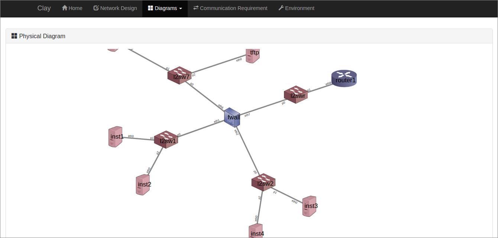
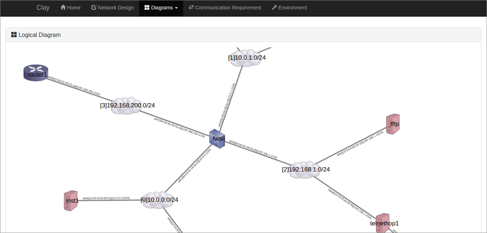

# Pottery

[](https://travis-ci.org/qb0C80aE/pottery)

Pottery is a simple GUI module works with [Loam](https://github.com/qb0C80aE/loam) on [Clay](https://github.com/qb0C80aE/clay).
It provides graphical network diagram views based on clay datastore.

### UI - network design


### UI - physial diagram from the system model store


### UI - logical diagram from the system model store


# How to build and run

```
$ # Note: Please install go-bindata first.
$ go get github.com/jteeuwen/go-bindata/...
$ # Prerequisites: glide has been installed already.
$ # Prerequisites: Clay has been cloned into $GOPATH/src/github.com/qb0C80aE/clay already.
$ cd $GOPATH/src/github.com/qb0C80aE/clay
$ # Edit: Add the '_ "github.com/qb0C80aE/loam" // Install Loam module by importing' line into the import section of main.go in Clay.
$ # Edit: Add the '_ "github.com/qb0C80aE/pottery" // Install Pottery module by importing' line into the import section of main.go in Clay.
$ glide get github.com/qb0C80aE/loam
$ glide get github.com/qb0C80aE/pottery
$ glide install
$ go generate -tags=prebuild ./...
$ go build
$ ./clay &
```

# How to use

## Example diagram

The diagram resource return the physical and logical diagram for [inet-henge](https://github.com/codeout/inet-henge) based on Loam data models.

```
$ curl -X GET "localhost:8080/diagrams/physical"
$ curl -X GET "localhost:8080/diagrams/logical"
```

## Example requirement

The requirement resource expresses communication requirement related to Loam models.

```
$ # register protocols
$ curl -X POST "localhost:8080/v1/protocols" -H "Content-Type: application/json" -d '{"name": "icmp"}'
$ curl -X POST "localhost:8080/v1/protocols" -H "Content-Type: application/json" -d '{"name": "tcp"}'
$ curl -X POST "localhost:8080/v1/protocols" -H "Content-Type: application/json" -d '{"name": "udp"}'
$ # register services
$ curl -X POST "localhost:8080/v1/services" -H "Content-Type: application/json" -d '{"name": "ping"}'
$ curl -X POST "localhost:8080/v1/services" -H "Content-Type: application/json" -d '{"name": "ssh"}'
$ curl -X POST "localhost:8080/v1/services" -H "Content-Type: application/json" -d '{"name": "http"}'
$ curl -X POST "localhost:8080/v1/services" -H "Content-Type: application/json" -d '{"name": "https"}'
$ curl -X POST "localhost:8080/v1/services" -H "Content-Type: application/json" -d '{"name": "dns"}'
$ # register connections
$ curl -X POST "localhost:8080/v1/connections" -H "Content-Type: application/json" -d '{"service_id": 1, "protocol_id": 1, "port_number": -1}'
$ curl -X POST "localhost:8080/v1/connections" -H "Content-Type: application/json" -d '{"service_id": 2, "protocol_id": 2, "port_number": 22}'
$ curl -X POST "localhost:8080/v1/connections" -H "Content-Type: application/json" -d '{"service_id": 3, "protocol_id": 2, "port_number": 80}'
$ curl -X POST "localhost:8080/v1/connections" -H "Content-Type: application/json" -d '{"service_id": 4, "protocol_id": 2, "port_number": 443}'
$ curl -X POST "localhost:8080/v1/connections" -H "Content-Type: application/json" -d '{"service_id": 5, "protocol_id": 2, "port_number": 53}'
$ curl -X POST "localhost:8080/v1/connections" -H "Content-Type: application/json" -d '{"service_id": 5, "protocol_id": 3, "port_number": 53}'
$ # register communication requirements
$ curl -X POST "localhost:8080/v1/requirements" -H "Content-Type: application/json" -d '{"source_port_id": {"Int64": 1, "Valid": true}, "destination_port_id": {"Int64": 2, "Valid": true}, "service_id": 1, "access": true}'
```

# Example test_case

The test_case resource expresses test cases related to requirement and Loam models.

```
$ # register test case
$ curl -X POST "localhost:8080/v1/test_cases" -F "test_runner_script_template=@examples/test_runner.sh"
$ # register test scripts
$ curl -X POST "localhost:8080/v1/test_commands" -H "Content-Type: multipart/form-data" -F "service_name=ping" -F "server_script_template=@examples/testscripts/ping_server.sh" -F "client_script_template=@examples/testscripts/ping_client.sh"
$ curl -X POST "localhost:8080/v1/test_commands" -H "Content-Type: multipart/form-data" -F "service_name=ssh" -F "server_script_template=@examples/testscripts/ssh_server.sh" -F "client_script_template=@examples/testscripts/ssh_client.sh"
$ curl -X POST "localhost:8080/v1/test_commands" -H "Content-Type: multipart/form-data" -F "service_name=http" -F "server_script_template=@examples/testscripts/http_server.sh" -F "client_script_template=@examples/testscripts/http_client.sh"
$ curl -X POST "localhost:8080/v1/test_commands" -H "Content-Type: multipart/form-data" -F "service_name=https" -F "server_script_template=@examples/testscripts/https_server.sh" -F "client_script_template=@examples/testscripts/https_client.sh"
$ # register test patterns
$ curl -X POST "localhost:8080/v1/test_patterns" -H "Content-Type: application/json" -d '{"test_case_id": 1, "test_command_id": 1}'
$ curl -X POST "localhost:8080/v1/test_patterns" -H "Content-Type: application/json" -d '{"test_case_id": 1, "test_command_id": 2}'
$ curl -X POST "localhost:8080/v1/test_patterns" -H "Content-Type: application/json" -d '{"test_case_id": 1, "test_command_id": 3}'
$ curl -X POST "localhost:8080/v1/test_patterns" -H "Content-Type: application/json" -d '{"test_case_id": 1, "test_command_id": 4}'
$ # check test case
$ curl -X GET "localhost:8080/v1/test_cases?preloads=TestPatterns,TestPatterns.TestCommand"
```

# API Server

## Endpoint list

### Diagram Resource

```
GET    /diagrams/physical
GET    /diagrams/logical
```

### Requirement Resource

```
GET    /<version>/requirements
GET    /<version>/requirements/:id
POST   /<version>/requirements
PUT    /<version>/requirements/:id
DELETE /<version>/requirements/:id
```

### TestCase Resource

```
GET    /<version>/test_cases
GET    /<version>/test_cases/:id
POST   /<version>/test_cases
PUT    /<version>/test_cases/:id
DELETE /<version>/test_cases/:id
```

# Thanks

* Pottery is using https://github.com/codeout/inet-henge to draw diagrams.
* Pottery is using http://www.quackit.com/html/templates/download/bootstrap/portal-1/ to make UI looking better.
